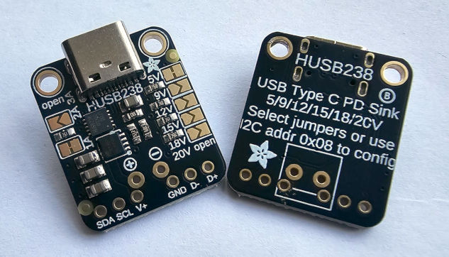

# Toit driver for the HUSB238 I2C-based PD Trigger
Toit Driver Library for the Hynetek HUSB238 PD Sink IC/module.



## Overview
The HUSB238 is a USB Power Delivery (PD) controller which can be used as a
___power sink___.  The datasheet for the IC shows wattage rating of up to 100W,
although different boards (such as the [AdaFruit
5807](https://learn.adafruit.com/adafruit-husb238-usb-type-c-power-delivery-breakout/arduino)
pictured) have different capacities, be sure to check out your boards limits
alongside those stated by the IC.

From 'Theory of Operation' in the [HUSB238 datasheet](https://en.hynetek.com/uploadfiles/site/219/news/aabbbbdb-48c9-4a44-a6dc-2c15f53282e6.pdf):
> The HUSB238 is a highly integrated USB Power Delivery (PD) controller as sink
> role. It’s compatible with PD3.0 and Type-C V1.4. It can also support Apple
> Divider 3, BC1.2 SDP, DCP and CDP while source is attached. When HUSB238 is
> connected to power source, it applies Rd to both CC lines, trying to establish
> USB Type-C connection.  After the USB Type-C connection is established, it
> monitors the CC lines to get source capabilities pack from USB PD source. If
> there is valid source capabilities pack before time out, the HUSB238 policy
> engine requests a power supply with voltage no greater than the programmed
> request voltage. If there is no valid source capabilities pack after time out,
> the HUSB238 switches to Apple divider 3 or BC1.2 mode trying to determine
> corresponding charging protocol.


### PD Introduction
To understand the the drivers' functions, basic understanding of Power Delivery
(PD) is required.  A recommended introduction, including acronyms and broader
information, is this [introduction to USB Power Delivery with
STM32](https://wiki.st.com/stm32mcu/wiki/Introduction_to_USB_Power_Delivery_with_STM32).
Main points:
- A core differentiator of the USB Type-C interface are the Control Channel (CC)
  lines.  These run at 300kbps, and allow the 2 connected partners to interact
  and negotiate many things, including:
   - Who is supplying the power, how much, etc (power role)
   - Who is the host/guest (the data role)
   - Authentication
   - Battery information, etc.
- For this device (HUSB238) the device will begin with the voltage and current
  configured using the jumpers/pads/dip switches (depending on device/model).
  After the MCU has started I2C and requested something else from the HUSB238,
  it will renegotiate and move to other voltages.  I2C configurations take
  priority over the physical jumpers/switches.
- When changing voltages etc, there is no consistent 5V from anywhere - the
  attached device must be able to react to what it is recieving.  I use a
  boost/buck converter to manage this.

### Why use this device?
There could be several reasons - some concrete examples:
- You have 12v LED devices which need 12v, but a microcontroller needing 5v.  With
  this device (and a boost/buck converter to give 5v to the ESP32) one can
  accept any USB power source, but then make an informed decision about what to
  do next with the power level it has recieved.
- You have many LEDs in your load, and wish to recieve as much of that 65W power
  supply as possible.  Some PD sources cap 12v at 3a making 36 W - whereas 20v
  capped at 3a is 60 W.  In this case, if your intended LED's are 12v you would
  require an additional converter, allowing a 5v and a 12v rail.  You could
  query the device and prevent the LED's from being switched on if the power
  supply isn't strong enough.

### PD Sequence Intro
1. When attaching, the power source and consumer (sink) determine roles and
   orientation.  The source turns on 5V and advertises current options. (If an
   electronically marked cable is used, it's capabilities are read.)
2. PD Signaling starts. Source sends source 'Power Delivery Options'. The sink
   picks one, and sends a 'Request'.
3. The source sends back an 'Accept', changes the power, and then signals
   'Ready'. At this point the situation is referred to as a 'contract'.
4. During operation, the sink can request voltage fine tuning, in steps as low
   as 20 mV/50 mA steps.  Either side can soft-reset, the source may resend
   capabilities, and faults can trigger Hard Reset which drops back to 5 V
   default.
5. A further specifications exist (eg PD3.1) allowing up to 240W, and 'role
   swap' features, for changing which partner is providing power.  Both of these
   are beyond the scope/capabilities of this IC.

## Usage
> [!WARNING]
> There is an inherent risk that making a mistake when using a configurable PD
> trigger could send the wrong voltage to your devices, potentially ruining them
> permanently.  Please use all cautions possible, including your voltmeter.
> Measure twice, cut once!

To use this device to power your 5V ESP32 project:
- After cabling, PD will automatically intitiate and set the voltage to the +/-
  pins to the PHYSICAL JUMPER CONFIGURATION.
- Assuming these are left at the defaults, 5 V present (Type-C attach via CC)
  and your ESP32 can get up and be able to listen/interact on I2C.
- Use the IC and this driver to list the source's advertised power capabilities,
  then send a request for the desired option (e.g., 20 V).  Current selection is
  not possible with the IC.
- After Accept + PS_RDY, the VBUS will be as at the new voltage.
- The current contract details can be queried again from the IC.  Renegotiation
  is also possible simply by running a new request.

### Example Operation
Please see the examples in the examples folder.  Note that the driver has been
written in such a way as the user should not have to deal with constants when
requesting voltages.  This does mean however that requesting unsupported
voltages will result in error.  Other special explanations below:

### Supported PD Voltage/Current Capabilities
The capabilities offered and supported by the Driver/IC are listed.  Not all
current/voltage combinations may be offered by any given device, capabilities
can vary. The results of the `get-capability` function return the maximum
current for each voltage rating, not all possible currents up to the maximum, as
is sometimes seen by PD listeners/testers.
#### Currents/Steps
  - 0.5A, 0.7A, 1A, 1.25, 1.5A, 1.75A, 2A, 2.25A, 2.5A, 2.75A, 3A, 3.25A, 3.5A,
    4A, 4.5A, 5A
#### Voltages
  - 5V, 9V, 12V, 15V, 18V, 20V
### Example 'get-capability' output:
Note that in the below example, 18v isn't a supported option at all, so whilst
it is supported by the IC, it is not supported by this PD device, so it is
missing from the list.
```
// Obtain the data and print it:
print "$(husb238-driver.get-capabilities)"

// Prints (in this case):
{5: 3.0, 9: 3.0, 12: 3.0, 15: 3.0, 20: 3.25}
```
> [!WARNING]
> `get-capabilities` uses cached information from when the driver was first
> instantiated.  This is because writing the GO command again when a contract is
> in place will cause it to reset to the physically jumpered voltages.  (If the
> jumpered contract is different, then the circut will change voltage
> unexpectedly.)  To override this and get fresh data, use
> `get-capabilities --force-refresh`.  The driver will attempt to request
> the last obtained contract directly after, but a monentary change in voltage
> is possible.

### Switching Voltage
```Toit
// Simplest Method (Establishing I2C Omitted)
result = husb238-driver.request-pdo it

// 'result' contains one of PD-STATUS1-RESPONSE-* constants.
```

### Hard Reset
The device has a 'hard reset' capability, which in this driver is called using
`hard-reset`.  This command seems to send the I2C bus for a spin.  Executing it
in the constructor causes the ESP32 to crash with an error of
'ESP_ERR_INVALID_STATE'.  This issue has not been worked through yet.

## Pinout Notes - Adafruit breakout
On the adafruit board pictured, the power pins and remaining data pins are quite
close together.  This may be on purpose.
- SDA/SCL - usual pins for I2C.
- D-/D+ - USB data pins.  These are a USB 2.0 data line for Apple Divider 3 and
  BC1.2.
- +/- - Actual PD power - this space is for a terminal block.
- V+/GND - these are tied to PD Power + and -.  Do not put the V+ on the rail
  you use to feed your other 3.3v I2C devices.. the voltage from this line needs
  external conversion to whatever voltage the ESP32/project needs. Check
  Adafruits [wiring
  examples](https://learn.adafruit.com/adafruit-husb238-usb-type-c-power-delivery-breakout/circuitpython-and-python)!


## Not Yet Implemented
- Currently, no support has been added yet for Apple Divider 3 and BC1.2.  (I
  don't have the devices etc to work this through.)
- Hard Reset - find a way to prevent (or recover from) I@C bus issues arising
  from using this command.

## Links
- [Introduction to USB Power Delivery with
  STM32](https://wiki.st.com/stm32mcu/wiki/Introduction_to_USB_Power_Delivery_with_STM32)
  - A good introduction, even if for a different product than this specific
  driver.
- TI Whitepaper on [USB PD Negotiations](https://www.ti.com/lit/an/slva842/slva842.pdf).
- [Hynetek HUSB238 Page](https://en.hynetek.com/2421.html) with links to the
  [Datasheet](https://www.hynetek.com/uploadfiles/site/219/news/aabbbbdb-48c9-4a44-a6dc-2c15f53282e6.pdf)
  and [Register
  List](https://en.hynetek.com/uploadfiles/site/219/news/eb6cc420-847e-40ec-a352-a86fbeedd331.pdf).

## Issues
If there are any issues, changes, or any other kind of feedback, please
[raise an issue](https://github.com/milkmansson/toit-husb238/issues).  Feedback
welcome and appreciated.

## Disclaimer
- This driver has been written and tested with an HUSB238 integrated into a
  Adafruit 5807 breakout board.
- All trademarks belong to their respective owners.
- No warranties for this work, express or implied.

## Credits
- [Florian](https://github.com/floitsch) for the tireless help and encouragement
- The wider Toit developer team (past and present) for a truly excellent product
- AI has been used for code and text reviews, analysing and compiling data and
  results, and assisting with ensuring accuracy.

## About Toit
One would assume you are here because you know what Toit is.  If you dont:
> Toit is a high-level, memory-safe language, with container/VM technology built
> specifically for microcontrollers (not a desktop language port). It gives fast
> iteration (live reloads over Wi-Fi in seconds), robust serviceability, and
> performance that’s far closer to C than typical scripting options on the
> ESP32. [[link](https://toitlang.org/)]
- [Review on Soracom](https://soracom.io/blog/internet-of-microcontrollers-made-easy-with-toit-x-soracom/)
- [Review on eeJournal](https://www.eejournal.com/article/its-time-to-get-toit)
